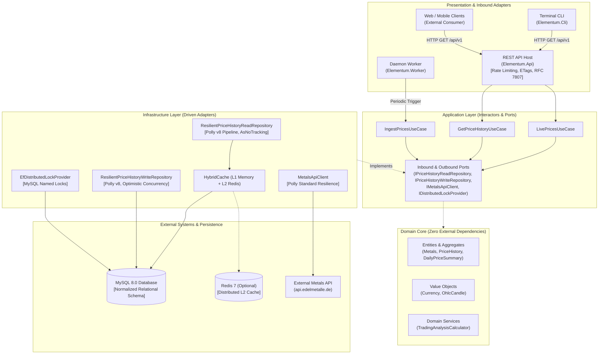

<div align="center">
  

  # Elementum
  
  **A modern, full-stack .NET application for real-time precious metal price tracking and trading analytics.**

  [](https://github.com/meelinaa/Elementum/actions/workflows/ci.yml)
  
  
  
  
  
</div>

<br />

---

## Table of Contents

- [Problem & Solution](#problem--solution)
- [Project Overview](#project-overview)
- [Tech Stack](#tech-stack)
- [Architecture & Design](#architecture--design)
- [Repository Structure](#repository-structure)
- [Prerequisites](#prerequisites)
- [Getting Started](#getting-started)
- [Running Automated Tests](#running-automated-tests)
- [Screenshots](#screenshots)
- [Related Documentation](#related-documentation)

---

## Problem & Solution

> **Problem:** Tracking precious metal spot prices over time (per metal, currency, and historical trends) usually requires manually aggregating fragmented data sources, dealing with API rate limits, and lacking consolidated technical analytics.
>
> **Solution:** **Elementum** automates periodic background price ingestion, consolidates daily candle data, and exposes real-time market overviews and technical trading indicators through a high-performance REST API and an interactive Terminal UI (CLI) — powered by a shared MySQL database with Polly v8 resilience, HybridCache L1/L2 caching, distributed locking, and IP-based rate limiting.

- **Stack:** .NET 10 (C# 13), ASP.NET Core, MySQL 8, Entity Framework Core, Docker & Docker Compose.
- **Key Capabilities:** Versioned endpoints (`/api/v1`), live market overviews (USD & EUR), real-time technical trading metrics (OHLC, spread, volatility %, bullish/bearish indicators), historical tick queries with `from`/`to` and `skip`/`take`, fail-fast configuration validation, Kubernetes-style health probes (`/health/live`, `/health/ready`), and 1-command Docker Compose deployment.

---

## Project Overview

**Elementum** is structured into decoupled architectural layers:

| Component | Layer | Description |
|-----------|-------|-------------|
| **Elementum.Domain** | Domain | Pure enterprise business models (`Metals`, `PriceHistory`, `DailyPriceSummary`), value object (`Currency`), domain service (`TradingAnalysisCalculator`), domain constants, and ports (`IPriceHistoryRepository`, `IMetalsApiClient`, `IDistributedLockProvider`). |
| **Elementum.Application** | Application | Use cases (`IngestPricesUseCase`, `LivePricesUseCase`, `GetPriceHistoryUseCase`), DTOs, mappers, and fail-fast options. |
| **Elementum.Infrastructure** | Infrastructure (Driven Adapters) | EF Core MySQL, Polly v8 (`Microsoft.Extensions.Http.Resilience`), `MetalsApiClient`, HybridCache (L1 + optional Redis L2), EF distributed lock. |
| **Elementum.Api** | Presentation (Driving Adapter) | ASP.NET Core REST API exposing live prices, trading indicators, and historical data with IP-based Rate Limiting. |
| **Elementum.Worker** | Presentation (Driving Adapter) | Background daemon for periodic price ingestion, candle consolidation, retention cleanup, and `System.Diagnostics.Metrics` instrumentation (`IngestionMetrics`). |
| **Elementum.Cli** | Presentation (Driving Adapter) | Interactive Console TUI client with real-time dashboard, trading indicators, metal master data, and charts. |
| **docker** | Deployment | Docker Compose: MySQL, Redis, API, Worker, optional Caddy. |

---

## Tech Stack

- **Runtime & Framework:** .NET 10 (C# 13)
- **Architecture:** Hexagonal / Clean Architecture (Ports & Adapters)
- **API & Security:** ASP.NET Core (REST), OpenAPI, IP-based Rate Limiting (`Microsoft.AspNetCore.RateLimiting`), RFC 7807 `ProblemDetails`, per-request timeouts
- **Configuration:** Fail-Fast Options Pattern with DataAnnotations validation (`ValidateDataAnnotations().ValidateOnStart()`)
- **Data & Persistence:** MySQL 8, Entity Framework Core, structured initialization & migrations
- **Caching & Concurrency:** Microsoft HybridCache (`Microsoft.Extensions.Caching.Hybrid` 10.9.0): L1 memory + optional L2 Redis. Distributed locking is **MySQL/EF**, not Redis.
- **Resilience:** Polly **v8** via `Microsoft.Extensions.Http.Resilience` (`AddStandardResilienceHandler`): HTTP timeout + retry + circuit breaker. Database retries via Polly v8 `ResiliencePipeline` on the port decorator.
- **Observability:** Serilog with `X-Correlation-ID`, health probes (`/health/live`, `/health/ready`). Worker metrics are `System.Diagnostics.Metrics` (`IngestionMetrics`) only — **no OpenTelemetry SDK, collector, or Prometheus endpoint**.
- **Testing:** xUnit. HTTP tests use `WebApplicationFactory` + EF **InMemory**. Persistence/migration tests use **Testcontainers MySQL**.

---

## Architecture & Design

### C4 Container & Hexagonal Architecture Model



- **Fail-Fast Configuration:** Zero silent fallbacks. Missing connection strings, invalid URLs, or out-of-range intervals immediately abort host startup with descriptive error messages.
- **Contract Decoupling (DTOs):** Domain and EF entities are never exposed across HTTP boundaries. All responses are projected via `PriceHistoryMapper`.
- **IP-Based Rate Limiting:** Built-in partition-based rate limiter returns `429 Too Many Requests` with RFC 7807 ProblemDetails when limits are exceeded.
- **Public read API (no auth, by design):** All HTTP endpoints are GET-only market quotes (Gold, Silver, Platinum, Palladium) sourced from a public upstream (`api.edelmetalle.de`). There are no accounts, personal data, or writes to authorize. Rate limiting is the abuse control.
- **Production CORS & TLS:** Compose sets `Cors__AllowedOrigins` from `CORS_ALLOWED_ORIGIN`. HTTPS terminates at Caddy (`docker compose --profile edge`); the API stays HTTP internally and honors `X-Forwarded-Proto`.

---

## Repository Structure

```
Elementum/
├── docker/                             # Docker Compose (MySQL + Redis + API + Worker + optional Caddy)
│   ├── docker-compose.yml
│   ├── Caddyfile                       # TLS termination (profile: edge)
│   ├── .env.example
│   └── README.md
├── Directory.Build.props               # TreatWarningsAsErrors (Release), Central Package Management
├── Directory.Packages.props            # Central Package Management — single NuGet version list (EF 9 / Pomelo 9 vs net10 skew documented)
├── nuget.config
├── src/                                # Source projects
│   ├── Elementum.Domain/               # Domain entities, value objects, constants & ports
│   ├── Elementum.Application/          # Use cases, DTOs, mappers & configuration options
│   ├── Elementum.Infrastructure/       # EF Core, HybridCache, external API client & Polly resilience
│   ├── Elementum.Api/                  # ASP.NET Core REST API & Rate Limiting
│   │   ├── README.md
│   │   └── API-Endpoints.md
│   ├── Elementum.Worker/               # Background ingestion daemon & metrics
│   │   └── README.md
│   └── Elementum.Cli/                  # Interactive Console CLI (TUI)
│       └── README.md
├── tests/                              # Test suites
│   ├── Elementum.UnitTests/            # Domain, Application, and API unit tests
│   └── Elementum.IntegrationTests/     # HTTP (InMemory) + MySQL Testcontainers
├── Elementum.slnx                      # Central .NET solution
└── README.md                           # This file
```

---

## Prerequisites

- **.NET 10 SDK** for building and running the projects
- **Docker & Docker Compose** for running containerized MySQL, API, and Worker
- **MySQL 8** (or the containerized instance)

---

## Getting Started

### Option 1: 1-Click Startup Script (Recommended for Windows)

Start the entire full-stack environment (Docker MySQL & Redis, API, Worker, and CLI Terminal) with a single command:

```powershell
# Using PowerShell
.\start-all.ps1

# Or double-click / run the Batch script
start-all.bat
```

To stop all services cleanly, simply close the CLI window, press `Q` in the PowerShell runner, or execute:
```powershell
.\stop-all.ps1
```

---

### Option 2: Docker Compose (Containers for DB + API + Worker)

1. Navigate to the `docker/` directory:
   ```bash
   cd docker
   cp .env.example .env
   ```
   Fill in `MYSQL_ROOT_PASSWORD`, `MYSQL_USER`, and `MYSQL_PASSWORD`, then:
   ```bash
   docker compose up -d
   ```
2. The API is available at **http://localhost:5000** (or the configured `API_PORT`).
   - Liveness Probe: `GET /health/live`
   - Readiness Probe: `GET /health/ready`
3. Run the CLI:
   ```bash
   dotnet run --project src/Elementum.Cli
   ```

---

### Option 3: Manual Local Development

1. Start MySQL & Redis (e.g. `docker compose -f docker/docker-compose.yml up -d mysql redis`).
2. Copy `appsettings.Development.json.example` to `appsettings.Development.json` under Api and Worker, then set `<MYSQL_USER>` / `<MYSQL_PASSWORD>`.
3. Run the API:
   ```bash
   dotnet run --project src/Elementum.Api
   ```
4. Run the Worker:
   ```bash
   dotnet run --project src/Elementum.Worker
   ```
5. Run the CLI:
   ```bash
   dotnet run --project src/Elementum.Cli
   ```

---

## Running Automated Tests

```bash
# Run all unit and integration tests
dotnet test Elementum.slnx

# Run in Release configuration
dotnet test Elementum.slnx --configuration Release
```

---

## Screenshots

### Main Menu


### Dashboard


### Trading View


### History View


### Info


---

## Related Documentation

- [API-Endpoints.md](src/Elementum.Api/API-Endpoints.md) — Complete REST API route documentation & DTOs
- [Elementum.Api README](src/Elementum.Api/README.md) — API architecture, rate limiting & hosting
- [Elementum.Worker README](src/Elementum.Worker/README.md) — Worker scheduling, daemon mode & metrics
- [Elementum.Cli README](src/Elementum.Cli/README.md) — Console client navigation & keyboard shortcuts
- [Docker README](docker/README.md) — Docker Compose configuration & deployment
